Analysis_LoL
================
Marshall Gallt
2/28/2022

# Introduction

League of Legends is a popular PC game. Teams all around the world
compete with the hopes of making it to Worlds. Riot has released data
for each player of each professional game of the 2022 season thus far.
In this project I will perform logistic regression in R on the
`2022 Match Data` found on Oracle Elixir’s [downloads
page](https://oracleselixir.com/tools/downloads).
`2022_LoL_esports_match_data_from_OraclesElixir_20220228.csv`

# Research Questions

In this logistic regression a number of questions could be posed.
Examples include, what indicates a winning score for each role, when is
gold income the most important, what objectives are the most decisive,
how do the teams and leagues differentiate in strategy.

# Data

First, a quick view of our data.

``` r
Lol_match_data_2022 <- 
  read_csv("2022_LoL_esports_match_data_from_OraclesElixir_20220228.csv")
```

    ## Rows: 30528 Columns: 123

    ## -- Column specification --------------------------------------------------------
    ## Delimiter: ","
    ## chr  (17): gameid, datacompleteness, url, league, split, side, position, pla...
    ## dbl  (85): year, playoffs, game, patch, participantid, gamelength, result, k...
    ## lgl  (20): firstdragon, elementaldrakes, opp_elementaldrakes, infernals, mou...
    ## dttm  (1): date

    ## 
    ## i Use `spec()` to retrieve the full column specification for this data.
    ## i Specify the column types or set `show_col_types = FALSE` to quiet this message.

``` r
head(Lol_match_data_2022)
```

    ## # A tibble: 6 x 123
    ##   gameid  datacompleteness url   league  year split playoffs date               
    ##   <chr>   <chr>            <chr> <chr>  <dbl> <chr>    <dbl> <dttm>             
    ## 1 ESPORT~ complete         <NA>  LCK CL  2022 Spri~        0 2022-01-10 07:44:08
    ## 2 ESPORT~ complete         <NA>  LCK CL  2022 Spri~        0 2022-01-10 07:44:08
    ## 3 ESPORT~ complete         <NA>  LCK CL  2022 Spri~        0 2022-01-10 07:44:08
    ## 4 ESPORT~ complete         <NA>  LCK CL  2022 Spri~        0 2022-01-10 07:44:08
    ## 5 ESPORT~ complete         <NA>  LCK CL  2022 Spri~        0 2022-01-10 07:44:08
    ## 6 ESPORT~ complete         <NA>  LCK CL  2022 Spri~        0 2022-01-10 07:44:08
    ## # ... with 115 more variables: game <dbl>, patch <dbl>, participantid <dbl>,
    ## #   side <chr>, position <chr>, playername <chr>, playerid <chr>,
    ## #   teamname <chr>, teamid <chr>, champion <chr>, ban1 <chr>, ban2 <chr>,
    ## #   ban3 <chr>, ban4 <chr>, ban5 <chr>, gamelength <dbl>, result <dbl>,
    ## #   kills <dbl>, deaths <dbl>, assists <dbl>, teamkills <dbl>,
    ## #   teamdeaths <dbl>, doublekills <dbl>, triplekills <dbl>, quadrakills <dbl>,
    ## #   pentakills <dbl>, firstblood <dbl>, firstbloodkill <dbl>, ...

The data we have available is quite large and detailed. So I will be
reducing the data to; key variables, the “LCS”(North American) `league`,
and the entire teams stats as valued as “team” for the `position`
variable.

``` r
LCS_matches <- Lol_match_data_2022 %>%
  filter(league == "LCS",
         position == "team") %>%
  subset(select = c('gameid',
                    'side',
                    'gamelength',
                    'result',
                    'firstblood',
                    'team kpm',
                    'firstdragon',
                    'dragons',
                    'firstbaron',
                    'barons',
                    'firsttower',
                    'towers',
                    'firstmidtower',
                    'firsttothreetowers',
                    'inhibitors',
                    'vspm',
                    'earned gpm',
                    'cspm'))
head(LCS_matches)
```

    ## # A tibble: 6 x 18
    ##   gameid       side  gamelength result firstblood `team kpm` firstdragon dragons
    ##   <chr>        <chr>      <dbl>  <dbl>      <dbl>      <dbl> <lgl>         <dbl>
    ## 1 ESPORTSTMNT~ Blue        1595      0          1     0.0376 FALSE             0
    ## 2 ESPORTSTMNT~ Red         1595      1          0     0.564  TRUE              4
    ## 3 ESPORTSTMNT~ Blue        2079      1          1     0.548  TRUE              4
    ## 4 ESPORTSTMNT~ Red         2079      0          0     0.260  FALSE             0
    ## 5 ESPORTSTMNT~ Blue        3007      0          0     0.299  TRUE              3
    ## 6 ESPORTSTMNT~ Red         3007      1          1     0.419  FALSE             4
    ## # ... with 10 more variables: firstbaron <lgl>, barons <dbl>, firsttower <lgl>,
    ## #   towers <dbl>, firstmidtower <lgl>, firsttothreetowers <lgl>,
    ## #   inhibitors <dbl>, vspm <dbl>, earned gpm <dbl>, cspm <dbl>

| Variable           | Type        | Description                                    |
|--------------------|-------------|------------------------------------------------|
| gameid             | Character   | Game identification (two teams)                |
| side               | Categorical | Side of the map given to team (Red or Blue)    |
| gamelength         | Numeric     | Length of game in seconds                      |
| result             | Binary      | Win = 1, lose = 0                              |
| team kpm           | Numeric     | Team’s kills per minute                        |
| firstdragon        | Binary      | True if team killed first dragon               |
| dragons            | Numeric     | Number of dragons killed by team               |
| firstbaron         | Binary      | True if team killed first baron                |
| barons             | Numeric     | Numer of dragons killed by team                |
| firsttower         | Binary      | True if team destroyed first tower             |
| towers             | Numeric     | Number of towers destroyed by team             |
| firstmidtower      | Binary      | True if team destroyed the first mid tower     |
| firsttothreetowers | Binary      | True if team was first to destroy three towers |
| inhibitors         | Numeric     | Number of inhibitors destroyed by team         |
| vspm               | Numeric     | Team’s vision score per minute                 |
| earned gpm         | Numeric     | Team’s gold earned per minute                  |
| cspm               | Numeric     | Team’s creep score per minute                  |

# Exploratory Data Analysis

First, we conduct an exploratory data analysis.

## Numerical Summaries

``` r
summary(LCS_matches)
```

    ##     gameid              side             gamelength       result   
    ##  Length:168         Length:168         Min.   :1443   Min.   :0.0  
    ##  Class :character   Class :character   1st Qu.:1762   1st Qu.:0.0  
    ##  Mode  :character   Mode  :character   Median :1956   Median :0.5  
    ##                                        Mean   :1998   Mean   :0.5  
    ##                                        3rd Qu.:2212   3rd Qu.:1.0  
    ##                                        Max.   :3007   Max.   :1.0  
    ##    firstblood     team kpm      firstdragon        dragons      firstbaron     
    ##  Min.   :0.0   Min.   :0.0376   Mode :logical   Min.   :0.000   Mode :logical  
    ##  1st Qu.:0.0   1st Qu.:0.2094   FALSE:84        1st Qu.:1.000   FALSE:85       
    ##  Median :0.5   Median :0.3488   TRUE :84        Median :2.000   TRUE :83       
    ##  Mean   :0.5   Mean   :0.3642                   Mean   :2.321                  
    ##  3rd Qu.:1.0   3rd Qu.:0.4976                   3rd Qu.:4.000                  
    ##  Max.   :1.0   Max.   :0.9979                   Max.   :5.000                  
    ##      barons       firsttower          towers       firstmidtower  
    ##  Min.   :0.0000   Mode :logical   Min.   : 0.000   Mode :logical  
    ##  1st Qu.:0.0000   FALSE:84        1st Qu.: 2.000   FALSE:84       
    ##  Median :1.0000   TRUE :84        Median : 7.000   TRUE :84       
    ##  Mean   :0.6726                   Mean   : 6.238                  
    ##  3rd Qu.:1.0000                   3rd Qu.:10.000                  
    ##  Max.   :3.0000                   Max.   :11.000                  
    ##  firsttothreetowers   inhibitors        vspm          earned gpm    
    ##  Mode :logical      Min.   :0.00   Min.   : 4.283   Min.   : 775.1  
    ##  FALSE:84           1st Qu.:0.00   1st Qu.: 6.851   1st Qu.: 977.6  
    ##  TRUE :84           Median :1.00   Median : 7.643   Median :1122.5  
    ##                     Mean   :1.06   Mean   : 7.571   Mean   :1137.9  
    ##                     3rd Qu.:2.00   3rd Qu.: 8.262   3rd Qu.:1289.1  
    ##                     Max.   :6.00   Max.   :10.363   Max.   :1467.6  
    ##       cspm      
    ##  Min.   :25.32  
    ##  1st Qu.:31.72  
    ##  Median :33.60  
    ##  Mean   :34.00  
    ##  3rd Qu.:35.56  
    ##  Max.   :46.13

## Graphical Summaries

### 

``` r
LCS_matches %>%
  data.matrix() %>%
  cor()%>%
  corrplot(is.corr = FALSE, order = 'FPC')
```

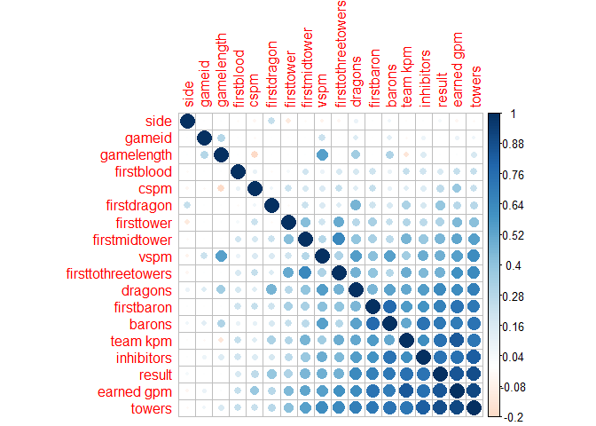<!-- --> ###
Checking data for relationships To check the shape of the data columns
to see if they might be well fit by any particular random variables, and
if there are any outliers, we plot histograms of each variable. These
reveal that to our luck, there aren’t any serious outliers and that also
specific pieces of data seem to fit specific distributions such as
Normal - gamelength, vspm, cspm Pareto/Exponential - inhibitors
Bivariate Normal - towers

This provides us some insight onto the nature of how these might affect
game outcomes.

``` r
hist.data.frame(LCS_matches)
```

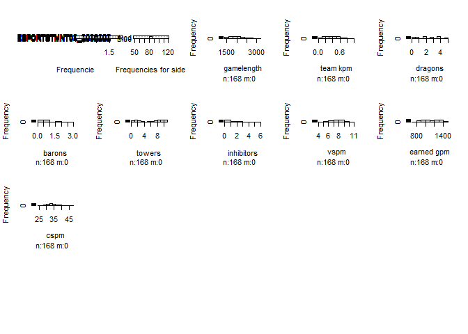<!-- -->

``` r
num_LCS <- LCS_matches %>%
  select_if(is.numeric)

for(i in 1:11) {
   boxplot(num_LCS[,i], main=names(num_LCS)[i])
}
```

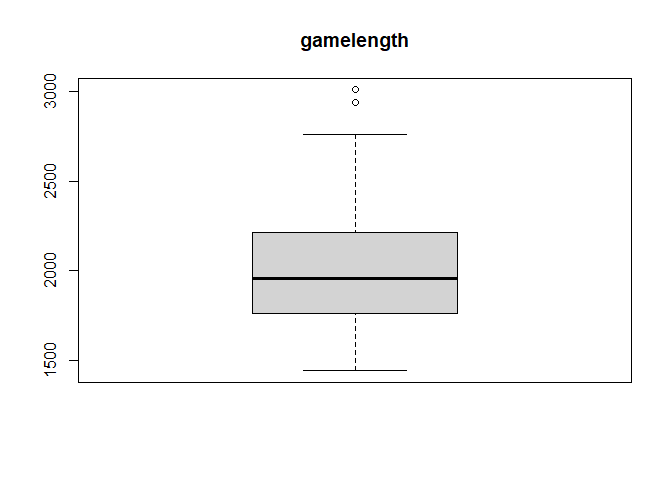<!-- -->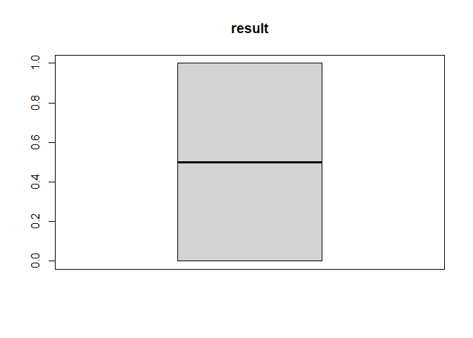<!-- -->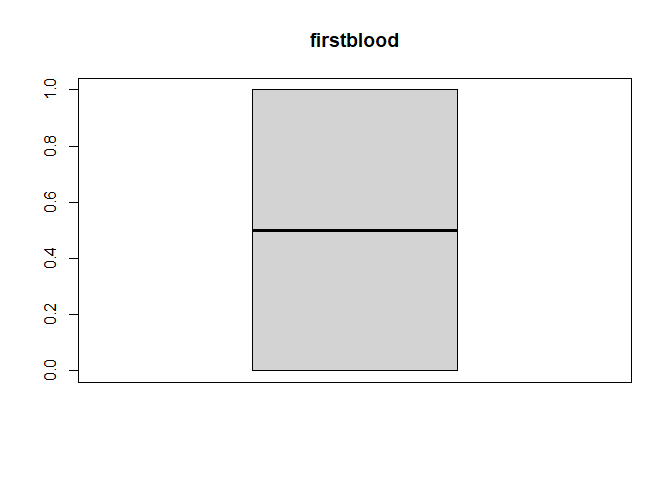<!-- -->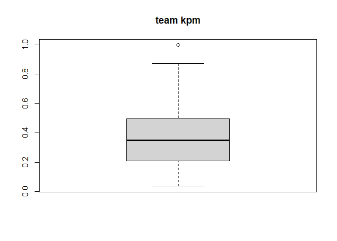<!-- -->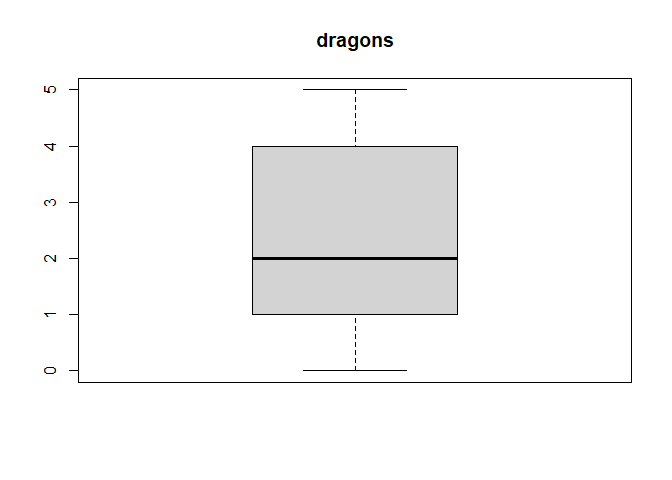<!-- -->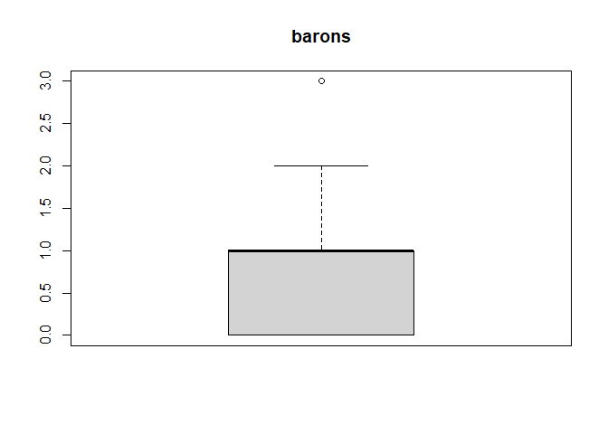<!-- -->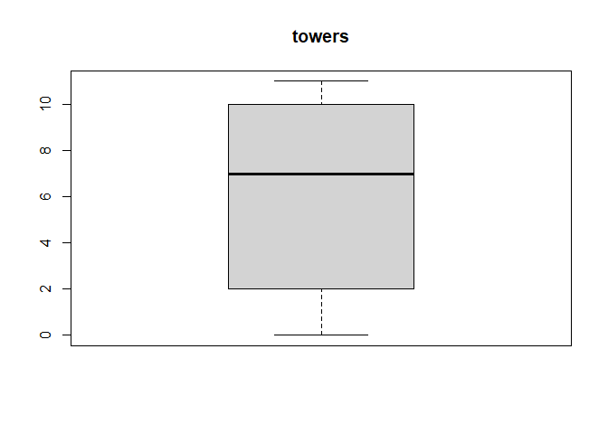<!-- -->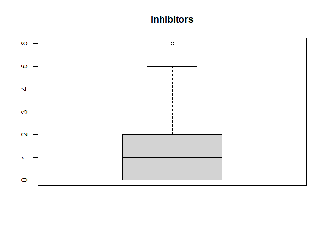<!-- -->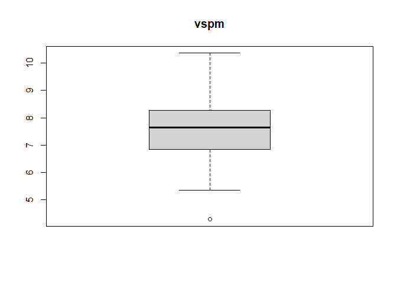<!-- -->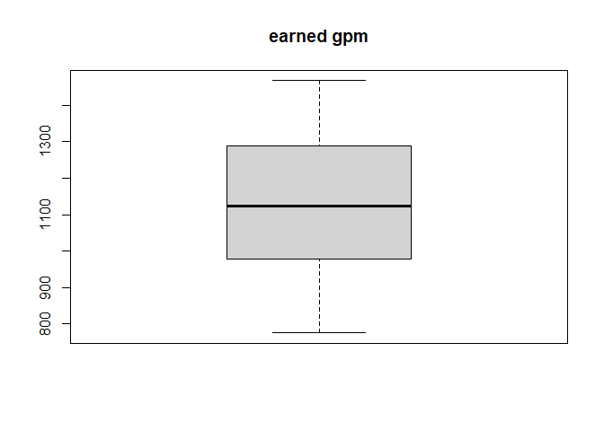<!-- -->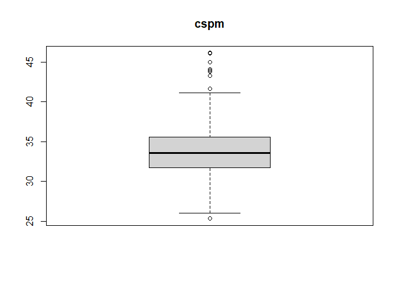<!-- -->

``` r
non_num_LCS <- LCS_matches %>%
  select_if(negate(is.numeric))
non_num_LCS
```

    ## # A tibble: 168 x 7
    ##    gameid side  firstdragon firstbaron firsttower firstmidtower firsttothreetow~
    ##    <chr>  <chr> <lgl>       <lgl>      <lgl>      <lgl>         <lgl>           
    ##  1 ESPOR~ Blue  FALSE       FALSE      FALSE      FALSE         FALSE           
    ##  2 ESPOR~ Red   TRUE        TRUE       TRUE       TRUE          TRUE            
    ##  3 ESPOR~ Blue  TRUE        TRUE       FALSE      FALSE         FALSE           
    ##  4 ESPOR~ Red   FALSE       FALSE      TRUE       TRUE          TRUE            
    ##  5 ESPOR~ Blue  TRUE        FALSE      TRUE       TRUE          TRUE            
    ##  6 ESPOR~ Red   FALSE       TRUE       FALSE      FALSE         FALSE           
    ##  7 ESPOR~ Blue  FALSE       TRUE       TRUE       TRUE          TRUE            
    ##  8 ESPOR~ Red   TRUE        FALSE      FALSE      FALSE         FALSE           
    ##  9 ESPOR~ Blue  TRUE        TRUE       TRUE       TRUE          TRUE            
    ## 10 ESPOR~ Red   FALSE       FALSE      FALSE      FALSE         FALSE           
    ## # ... with 158 more rows

``` r
#for (i in 1:7) {
#  non_num_LCS %>%
#    count(i)
#}
```

# Data Cleaning

# Data Analysis

# Hypotheses

# Modeling

# Conclusion
