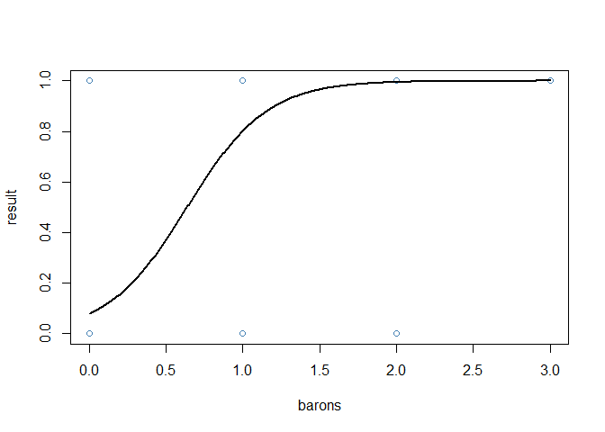

Analysis_LoL
================
Marshall Gallt
2/28/2022

# Introduction

League of Legends is a popular PC game. Teams all around the world
compete with the hopes of making it to Worlds. Riot has released data
for each player of each professional game of the 2022 season thus far.
In this project I will perform logistic regression in R on the
`2022 Match Data` found on Oracle Elixir’s [downloads
page](https://oracleselixir.com/tools/downloads).
`2022_LoL_esports_match_data_from_OraclesElixir_20220228.csv`

# Research Questions

In this logistic regression a number of questions could be posed.
Examples include, what indicates a winning score for each role, when is
gold income the most important, what objectives are the most decisive,
how do the teams and leagues differentiate in strategy.

# Data

First, a quick view of our data.

``` r
Lol_match_data_2022 <- 
  read_csv("2022_LoL_esports_match_data_from_OraclesElixir_20220228.csv")
```

    ## Rows: 30528 Columns: 123

    ## -- Column specification --------------------------------------------------------
    ## Delimiter: ","
    ## chr  (17): gameid, datacompleteness, url, league, split, side, position, pla...
    ## dbl  (85): year, playoffs, game, patch, participantid, gamelength, result, k...
    ## lgl  (20): firstdragon, elementaldrakes, opp_elementaldrakes, infernals, mou...
    ## dttm  (1): date

    ## 
    ## i Use `spec()` to retrieve the full column specification for this data.
    ## i Specify the column types or set `show_col_types = FALSE` to quiet this message.

``` r
Lol_match_data_2022
```

    ## # A tibble: 30,528 x 123
    ##    gameid datacompleteness url   league  year split playoffs date               
    ##    <chr>  <chr>            <chr> <chr>  <dbl> <chr>    <dbl> <dttm>             
    ##  1 ESPOR~ complete         <NA>  LCK CL  2022 Spri~        0 2022-01-10 07:44:08
    ##  2 ESPOR~ complete         <NA>  LCK CL  2022 Spri~        0 2022-01-10 07:44:08
    ##  3 ESPOR~ complete         <NA>  LCK CL  2022 Spri~        0 2022-01-10 07:44:08
    ##  4 ESPOR~ complete         <NA>  LCK CL  2022 Spri~        0 2022-01-10 07:44:08
    ##  5 ESPOR~ complete         <NA>  LCK CL  2022 Spri~        0 2022-01-10 07:44:08
    ##  6 ESPOR~ complete         <NA>  LCK CL  2022 Spri~        0 2022-01-10 07:44:08
    ##  7 ESPOR~ complete         <NA>  LCK CL  2022 Spri~        0 2022-01-10 07:44:08
    ##  8 ESPOR~ complete         <NA>  LCK CL  2022 Spri~        0 2022-01-10 07:44:08
    ##  9 ESPOR~ complete         <NA>  LCK CL  2022 Spri~        0 2022-01-10 07:44:08
    ## 10 ESPOR~ complete         <NA>  LCK CL  2022 Spri~        0 2022-01-10 07:44:08
    ## # ... with 30,518 more rows, and 115 more variables: game <dbl>, patch <dbl>,
    ## #   participantid <dbl>, side <chr>, position <chr>, playername <chr>,
    ## #   playerid <chr>, teamname <chr>, teamid <chr>, champion <chr>, ban1 <chr>,
    ## #   ban2 <chr>, ban3 <chr>, ban4 <chr>, ban5 <chr>, gamelength <dbl>,
    ## #   result <dbl>, kills <dbl>, deaths <dbl>, assists <dbl>, teamkills <dbl>,
    ## #   teamdeaths <dbl>, doublekills <dbl>, triplekills <dbl>, quadrakills <dbl>,
    ## #   pentakills <dbl>, firstblood <dbl>, firstbloodkill <dbl>, ...

The data we have available is quite large and detailed. So I will be
reducing the data to; key variables, the “LCS”(North American) `league`,
and the entire teams stats as valued as “team” for the `position`
variable.

``` r
LCS_matches <- Lol_match_data_2022 %>%
  filter(league == "LCS",
         position == "team") %>%
  subset(select = c('gameid',
                    'side',
                    'gamelength',
                    'result',
                    'firstblood',
                    'team kpm',
                    'firstdragon',
                    'dragons',
                    'firstbaron',
                    'barons',
                    'firsttower',
                    'towers',
                    'firstmidtower',
                    'firsttothreetowers',
                    'inhibitors',
                    'vspm',
                    'earned gpm',
                    'cspm')) %>%
  rename(earned_gpm = `earned gpm`,
         team_kpm = `team kpm`)

LCS_matches$result <- LCS_matches$result == TRUE

LCS_matches
```

    ## # A tibble: 168 x 18
    ##    gameid        side  gamelength result firstblood team_kpm firstdragon dragons
    ##    <chr>         <chr>      <dbl> <lgl>       <dbl>    <dbl> <lgl>         <dbl>
    ##  1 ESPORTSTMNT0~ Blue        1595 FALSE           1   0.0376 FALSE             0
    ##  2 ESPORTSTMNT0~ Red         1595 TRUE            0   0.564  TRUE              4
    ##  3 ESPORTSTMNT0~ Blue        2079 TRUE            1   0.548  TRUE              4
    ##  4 ESPORTSTMNT0~ Red         2079 FALSE           0   0.260  FALSE             0
    ##  5 ESPORTSTMNT0~ Blue        3007 FALSE           0   0.299  TRUE              3
    ##  6 ESPORTSTMNT0~ Red         3007 TRUE            1   0.419  FALSE             4
    ##  7 ESPORTSTMNT0~ Blue        1976 TRUE            0   0.668  FALSE             2
    ##  8 ESPORTSTMNT0~ Red         1976 FALSE           1   0.334  TRUE              2
    ##  9 ESPORTSTMNT0~ Blue        2149 TRUE            0   0.475  TRUE              5
    ## 10 ESPORTSTMNT0~ Red         2149 FALSE           1   0.335  FALSE             0
    ## # ... with 158 more rows, and 10 more variables: firstbaron <lgl>,
    ## #   barons <dbl>, firsttower <lgl>, towers <dbl>, firstmidtower <lgl>,
    ## #   firsttothreetowers <lgl>, inhibitors <dbl>, vspm <dbl>, earned_gpm <dbl>,
    ## #   cspm <dbl>

| Variable           | Type        | Description                                    |
|--------------------|-------------|------------------------------------------------|
| gameid             | Character   | Game identification (two teams)                |
| side               | Categorical | Side of the map given to team (Red or Blue)    |
| gamelength         | Numeric     | Length of game in seconds                      |
| result             | Binary      | Win = 1, lose = 0                              |
| team_kpm           | Numeric     | Team’s kills per minute                        |
| firstdragon        | Binary      | True if team killed first dragon               |
| dragons            | Numeric     | Number of dragons killed by team               |
| firstbaron         | Binary      | True if team killed first baron                |
| barons             | Numeric     | Numer of dragons killed by team                |
| firsttower         | Binary      | True if team destroyed first tower             |
| towers             | Numeric     | Number of towers destroyed by team             |
| firstmidtower      | Binary      | True if team destroyed the first mid tower     |
| firsttothreetowers | Binary      | True if team was first to destroy three towers |
| inhibitors         | Numeric     | Number of inhibitors destroyed by team         |
| vspm               | Numeric     | Team’s vision score per minute                 |
| earned_gpm         | Numeric     | Team’s gold earned per minute                  |
| cspm               | Numeric     | Team’s creep score per minute                  |

# Exploratory Data Analysis

First, we conduct an exploratory data analysis.

## Numerical Summaries

``` r
summary(LCS_matches)
```

    ##     gameid              side             gamelength     result       
    ##  Length:168         Length:168         Min.   :1443   Mode :logical  
    ##  Class :character   Class :character   1st Qu.:1762   FALSE:84       
    ##  Mode  :character   Mode  :character   Median :1956   TRUE :84       
    ##                                        Mean   :1998                  
    ##                                        3rd Qu.:2212                  
    ##                                        Max.   :3007                  
    ##    firstblood     team_kpm      firstdragon        dragons      firstbaron     
    ##  Min.   :0.0   Min.   :0.0376   Mode :logical   Min.   :0.000   Mode :logical  
    ##  1st Qu.:0.0   1st Qu.:0.2094   FALSE:84        1st Qu.:1.000   FALSE:85       
    ##  Median :0.5   Median :0.3488   TRUE :84        Median :2.000   TRUE :83       
    ##  Mean   :0.5   Mean   :0.3642                   Mean   :2.321                  
    ##  3rd Qu.:1.0   3rd Qu.:0.4976                   3rd Qu.:4.000                  
    ##  Max.   :1.0   Max.   :0.9979                   Max.   :5.000                  
    ##      barons       firsttower          towers       firstmidtower  
    ##  Min.   :0.0000   Mode :logical   Min.   : 0.000   Mode :logical  
    ##  1st Qu.:0.0000   FALSE:84        1st Qu.: 2.000   FALSE:84       
    ##  Median :1.0000   TRUE :84        Median : 7.000   TRUE :84       
    ##  Mean   :0.6726                   Mean   : 6.238                  
    ##  3rd Qu.:1.0000                   3rd Qu.:10.000                  
    ##  Max.   :3.0000                   Max.   :11.000                  
    ##  firsttothreetowers   inhibitors        vspm          earned_gpm    
    ##  Mode :logical      Min.   :0.00   Min.   : 4.283   Min.   : 775.1  
    ##  FALSE:84           1st Qu.:0.00   1st Qu.: 6.851   1st Qu.: 977.6  
    ##  TRUE :84           Median :1.00   Median : 7.643   Median :1122.5  
    ##                     Mean   :1.06   Mean   : 7.571   Mean   :1137.9  
    ##                     3rd Qu.:2.00   3rd Qu.: 8.262   3rd Qu.:1289.1  
    ##                     Max.   :6.00   Max.   :10.363   Max.   :1467.6  
    ##       cspm      
    ##  Min.   :25.32  
    ##  1st Qu.:31.72  
    ##  Median :33.60  
    ##  Mean   :34.00  
    ##  3rd Qu.:35.56  
    ##  Max.   :46.13

## Graphical Summaries

### Pearson corrolation plot

Here we create a correlation that visualizes the linear correlation
between each pair of variables

``` r
LCS_matches %>%
  data.matrix() %>%
  cor()%>%
  corrplot(is.corr = FALSE, order = 'FPC')
```

<!-- -->

### Checking data for relationships

To check the shape of the data columns to see if they might be well fit
by any particular random variables, and if there are any outliers, we
plot histograms and whisker plots of each variable as applicable.

``` r
hist.data.frame(LCS_matches)
```

<!-- -->

``` r
num_LCS <- LCS_matches %>%
  select_if(is.numeric)

for(i in 1:10) {
   boxplot(num_LCS[,i], main=names(num_LCS)[i])
}
```

<!-- --><!-- --><!-- --><!-- --><!-- --><!-- --><!-- --><!-- --><!-- --><!-- -->

These reveal that to our luck, there aren’t any serious outliers and
that also specific pieces of data seem to fit specific distributions
such as Normal - gamelength, vspm, cspm Pareto/Exponential - inhibitors
Bivariate Normal - towers

This provides us some insight onto the nature of how these might affect
game outcomes and also how they may relate to one another

``` r
cols <- character(nrow(LCS_matches))
cols[] <- "black"
cols[LCS_matches$result == TRUE] <- "red"


pairs(num_LCS, col=cols, order = "FPC")
```

<!-- -->

``` r
LCS_model = lm(LCS_matches$result ~ ., data = num_LCS)
summary(LCS_model)
```

    ## 
    ## Call:
    ## lm(formula = LCS_matches$result ~ ., data = num_LCS)
    ## 
    ## Residuals:
    ##      Min       1Q   Median       3Q      Max 
    ## -0.69031 -0.09524  0.00218  0.12265  0.56692 
    ## 
    ## Coefficients:
    ##               Estimate Std. Error t value Pr(>|t|)    
    ## (Intercept)  2.712e-01  2.810e-01   0.965 0.336080    
    ## gamelength  -2.646e-04  7.169e-05  -3.691 0.000308 ***
    ## firstblood  -4.213e-02  3.279e-02  -1.285 0.200671    
    ## team_kpm     4.016e-01  1.896e-01   2.118 0.035754 *  
    ## dragons      3.874e-02  1.588e-02   2.440 0.015805 *  
    ## barons       1.597e-01  3.908e-02   4.086 6.99e-05 ***
    ## towers       9.784e-02  1.321e-02   7.409 7.35e-12 ***
    ## inhibitors  -3.119e-02  2.407e-02  -1.296 0.196950    
    ## vspm        -1.049e-02  2.426e-02  -0.432 0.666067    
    ## earned_gpm  -2.497e-04  3.313e-04  -0.754 0.452244    
    ## cspm         6.504e-03  5.656e-03   1.150 0.251971    
    ## ---
    ## Signif. codes:  0 '***' 0.001 '**' 0.01 '*' 0.05 '.' 0.1 ' ' 1
    ## 
    ## Residual standard error: 0.203 on 157 degrees of freedom
    ## Multiple R-squared:  0.8459, Adjusted R-squared:  0.8361 
    ## F-statistic: 86.18 on 10 and 157 DF,  p-value: < 2.2e-16

### Regressions of strongly correlated variables

Here we will do some regression modeling of `result` vs
`towers`,`inhibitors`, `earned_gpm`, and `team_kpm`. I’ve chosen these
variables because they all strongly correlate with each other and
display similar correlation patterns with the other variables.

``` r
input <- LCS_matches[,c("result", "towers")]

model_towers <- glm(formula = result ~ towers, data = input, family = binomial)
summary(model_towers)
```

    ## 
    ## Call:
    ## glm(formula = result ~ towers, family = binomial, data = input)
    ## 
    ## Deviance Residuals: 
    ##      Min        1Q    Median        3Q       Max  
    ## -3.00942  -0.03561   0.03111   0.14736   1.15107  
    ## 
    ## Coefficients:
    ##             Estimate Std. Error z value Pr(>|z|)    
    ## (Intercept) -10.3331     2.3523  -4.393 1.12e-05 ***
    ## towers        1.4851     0.3082   4.819 1.44e-06 ***
    ## ---
    ## Signif. codes:  0 '***' 0.001 '**' 0.01 '*' 0.05 '.' 0.1 ' ' 1
    ## 
    ## (Dispersion parameter for binomial family taken to be 1)
    ## 
    ##     Null deviance: 232.897  on 167  degrees of freedom
    ## Residual deviance:  43.869  on 166  degrees of freedom
    ## AIC: 47.869
    ## 
    ## Number of Fisher Scoring iterations: 8

``` r
tower_regression <- data.frame(towers=seq(min(LCS_matches$towers),
                                          max(LCS_matches$towers),
                                          len=500))

tower_regression$result = predict(model_towers, 
                                  tower_regression, 
                                  type="response")

plot(result ~ towers,
     data=LCS_matches,
     col="steelblue")

lines(result ~ towers,
      tower_regression,
      lwd=2)
```

<!-- -->

``` r
input <- LCS_matches[,c("result", "barons")]

model_barons <- glm(formula = result ~ barons,
                        data = input,
                        family = binomial)

summary(model_barons)
```

    ## 
    ## Call:
    ## glm(formula = result ~ barons, family = binomial, data = input)
    ## 
    ## Deviance Residuals: 
    ##     Min       1Q   Median       3Q      Max  
    ## -3.2444  -0.4054  -0.1953   0.6639   2.2538  
    ## 
    ## Coefficients:
    ##             Estimate Std. Error z value Pr(>|z|)    
    ## (Intercept)  -2.4575     0.4252   -5.78 7.47e-09 ***
    ## barons        3.8578     0.5076    7.60 2.96e-14 ***
    ## ---
    ## Signif. codes:  0 '***' 0.001 '**' 0.01 '*' 0.05 '.' 0.1 ' ' 1
    ## 
    ## (Dispersion parameter for binomial family taken to be 1)
    ## 
    ##     Null deviance: 232.90  on 167  degrees of freedom
    ## Residual deviance: 117.05  on 166  degrees of freedom
    ## AIC: 121.05
    ## 
    ## Number of Fisher Scoring iterations: 5

``` r
baron_regression <- data.frame(barons=seq(min(LCS_matches$barons),
                                                  max(LCS_matches$barons),
                                                  len=500))

baron_regression$result = predict(model_barons,
                                      baron_regression,
                                      type="response")

plot(result ~ barons,
     data=LCS_matches,
     col="steelblue")

lines(result ~ barons,
      baron_regression,
      lwd=2)
```

<!-- -->

``` r
input <- LCS_matches[,c("result", "dragons")]

model_dragons <- glm(formula = result ~ dragons,
                        data = input,
                        family = binomial)

summary(model_dragons)
```

    ## 
    ## Call:
    ## glm(formula = result ~ dragons, family = binomial, data = input)
    ## 
    ## Deviance Residuals: 
    ##      Min        1Q    Median        3Q       Max  
    ## -2.09297  -0.58743  -0.02898   0.48715   2.43697  
    ## 
    ## Coefficients:
    ##             Estimate Std. Error z value Pr(>|z|)    
    ## (Intercept)  -2.9167     0.4773  -6.111 9.89e-10 ***
    ## dragons       1.2471     0.1843   6.767 1.31e-11 ***
    ## ---
    ## Signif. codes:  0 '***' 0.001 '**' 0.01 '*' 0.05 '.' 0.1 ' ' 1
    ## 
    ## (Dispersion parameter for binomial family taken to be 1)
    ## 
    ##     Null deviance: 232.90  on 167  degrees of freedom
    ## Residual deviance: 154.17  on 166  degrees of freedom
    ## AIC: 158.17
    ## 
    ## Number of Fisher Scoring iterations: 5

``` r
dragon_regression <- data.frame(dragons = seq(min(LCS_matches$dragons),
                                                  max(LCS_matches$dragons),
                                                  len = 500))

dragon_regression$result = predict(model_dragons,
                                      dragon_regression,
                                      type = "response")

plot(result ~ dragons,
     data = LCS_matches,
     col = "steelblue")

lines(result ~ dragons,
      dragon_regression,
      lwd = 2)
```

<!-- -->

``` r
input <- LCS_matches[,c("result", "team_kpm")]

model_tkpm <- glm(formula = result ~ team_kpm,
                        data = input,
                        family = binomial)

summary(model_tkpm)
```

    ## 
    ## Call:
    ## glm(formula = result ~ team_kpm, family = binomial, data = input)
    ## 
    ## Deviance Residuals: 
    ##      Min        1Q    Median        3Q       Max  
    ## -2.97707  -0.35346  -0.03249   0.36333   2.63870  
    ## 
    ## Coefficients:
    ##             Estimate Std. Error z value Pr(>|z|)    
    ## (Intercept)   -6.797      1.054  -6.451 1.11e-10 ***
    ## team_kpm      19.246      2.916   6.600 4.10e-11 ***
    ## ---
    ## Signif. codes:  0 '***' 0.001 '**' 0.01 '*' 0.05 '.' 0.1 ' ' 1
    ## 
    ## (Dispersion parameter for binomial family taken to be 1)
    ## 
    ##     Null deviance: 232.897  on 167  degrees of freedom
    ## Residual deviance:  98.553  on 166  degrees of freedom
    ## AIC: 102.55
    ## 
    ## Number of Fisher Scoring iterations: 6

``` r
tkpm_regression <- data.frame(team_kpm = seq(min(LCS_matches$team_kpm),
                                                  max(LCS_matches$team_kpm),
                                                  len = 500))

tkpm_regression$result = predict(model_tkpm,
                                 tkpm_regression,
                                 type = "response")

plot(result ~ team_kpm,
     data = LCS_matches,
     col = "steelblue")

lines(result ~ team_kpm,
      tkpm_regression,
      lwd = 2)
```

<!-- -->

# Data Cleaning and Wrangling

As seen in our `summary` of `LCS_matches`, after reducing our dataset we
no longer have any missing values! There’s one other thing we want to
consider in data cleaning though, outliers. From our whisker plots we do
see outliers. However, I don’t believe that any of them are outlandish
enough to warrant removal. So it appears there’s no cleaning to do.

I’ll note that I’ve already made a few changes to the data in pursuit of
peace; I’ve changed the variables names of `team kpm` and `earned gpm`
to `team_kpm` and `earned_gpm`. As well as converted `result` to logical
values. This was simple due to the cleanliness of our data.

I would further my data wrangling by combining and binning some of my
strongly correlated variables.

``` r
new_model = lm(LCS_matches$result ~ . - towers, data = LCS_matches)
summary(new_model)$r.squared
```

    ## [1] 0.8893055

``` r
new_model = lm(LCS_matches$result ~ . - barons, data = LCS_matches)
summary(new_model)$r.squared
```

    ## [1] 0.925727

``` r
new_model = lm(LCS_matches$result ~ . - dragons, data = LCS_matches)
summary(new_model)$r.squared
```

    ## [1] 0.9302447

``` r
new_model = new_model = lm(LCS_matches$result ~ . - team_kpm, data = LCS_matches)
summary(new_model)$r.squared
```

    ## [1] 0.9296008

Since

# Data Analysis

# Hypotheses

# Modeling

# Conclusion
